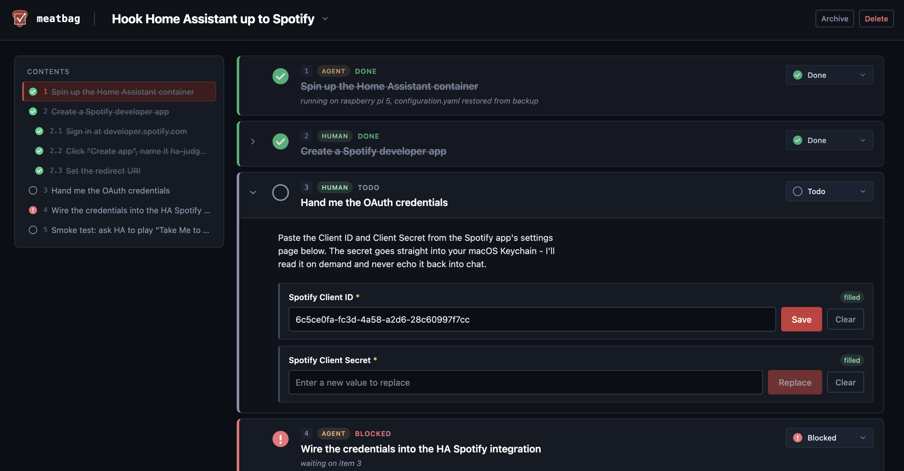

# meatbag

> *Ever followed an agent's steps to generate a client secret, watched the
> instructions get buried in chat history, and not known how to safely hand
> the secret back?*

meatbag is a local CLI + web UI for the shared to-do list between you and
the agent. The agent drives `meatbag` from its shell to create lists, nest
items, and request structured inputs (text, files, secrets, permission-gated
actions). You work through the list in a local web UI: fill inputs, approve
gated steps, check items off. `meatbag wait` lets the agent register
listeners before prompting, so it wakes up the moment you change something -
no polling, no missed updates. Instructions live in the list, not in chat
history.

Everything is stored locally. List state is plain YAML under `~/.meatbag/`,
secrets land in the macOS Keychain, and file uploads are content-addressed
blobs on disk.



## Install

```
make install     # builds, then installs to ~/.local/bin/meatbag
```

`make install` builds a fresh binary, stops the running daemon (if any),
atomically swaps the on-PATH binary, and restarts the daemon so the new
version is live. Pass `INSTALL_ARGS` to install somewhere else:

```
make install INSTALL_ARGS="--target=/usr/local/bin"
```

Ensure the install directory is on `$PATH`. For the default location:

```
export PATH="$HOME/.local/bin:$PATH"   # add to ~/.zshrc or ~/.bashrc
```

Once the binary is on `$PATH`, subsequent upgrades skip the clone/make loop
and use `meatbag install` directly - it's the same atomic-swap path that
`make install` wraps. Pass `--target <path>` to install somewhere other
than the default `$HOME/.local/bin/meatbag`, and `--no-restart` to skip
the daemon respawn when you'd rather restart it yourself.

Quick smoke test once it's installed:

```
meatbag list create --title "Set up new laptop"
meatbag web start
meatbag url set-up-new-laptop
```

## Hook it up to your agent

LLM agents won't know meatbag is available unless you tell them. The easiest
way is to paste a small markdown snippet into the agent config file your
tool already reads (CLAUDE.md, AGENTS.md, `.cursorrules`, etc.) so the agent
picks it up automatically each session.

Print the snippet:

```
meatbag agent snippet
```

Or append it directly to a project-level config file:

```
meatbag agent snippet >> CLAUDE.md
```

The snippet is intentionally short. It points the agent at `meatbag agent
help` for the full usage guide once it decides meatbag is the right tool
for the job.

## Developer reference

- `docs/agent-guide.md` - the full agent-facing guide (also printed by
  `meatbag agent help`). Good background even if you're not the agent.
- `docs/architecture.md` - how the CLI, daemon, and UI fit together and
  what the on-disk layout looks like.
- `docs/data-model.md` - YAML schema, label scheme, input types, where
  secrets and blobs live.
- `docs/stretch-goals.md` - things deferred from v1.

### Build from source

```
make build       # builds UI + binary -> bin/meatbag
make ui          # ui only
make test        # go test ./...
```
